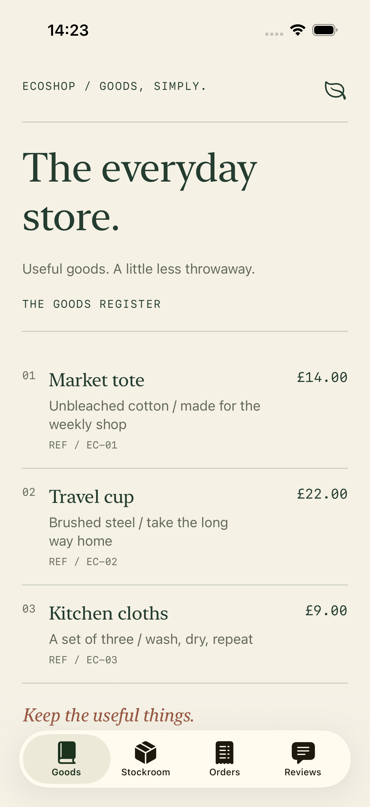
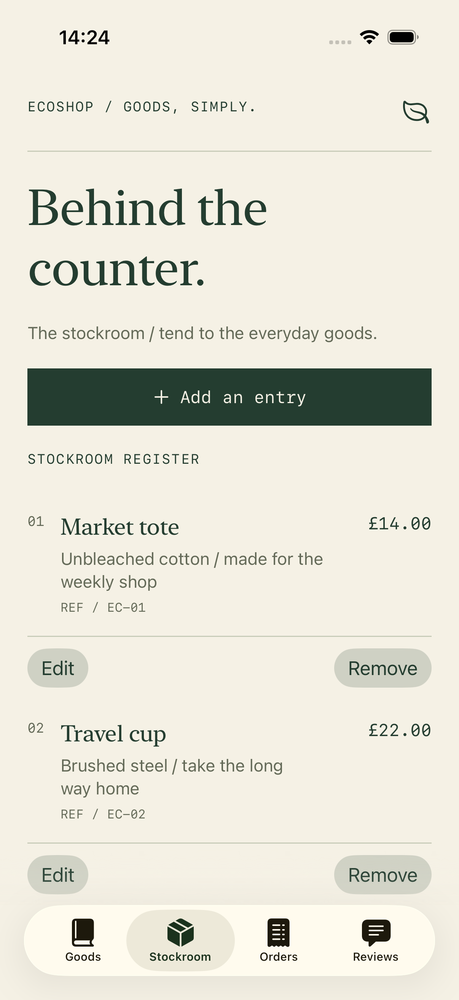

# 04 · Interface Segregation

[All lessons](../README.md) · [Setup and test commands](../docs/SETUP.md)

Clients should not be forced to depend on operations they do not use. Shape interfaces around the needs of their consumers.

**EcoShop** is a small SwiftUI shopkeeper’s ledger. Browse the goods, tend the stockroom, record orders, and read customer notes. Its main teaching example is the boundary between reading a catalog and changing it.

## Run the app

Open the [Xcode project](EcoShop%20Backend%20ISP.xcodeproj), select the shared `EcoShop Backend ISP` scheme and a compatible iPhone simulator, then press **Cmd+R**.

- **Goods** is a read-only register of names, descriptions, references, and GBP prices.
- **Stockroom** adds, edits, and removes entries. Returning to Goods reloads the shared store.
- **Orders** and **Reviews** use their own services and keep independent records.

Debug and Release both open the same seeded, in-memory sample shop. Changes last until the app process ends. Despite the folder name, this is an iOS teaching app, not a deployed backend or a checkout service.




Actual simulator screenshots, not concept mockups.

## Before: readers depend on a management API

Illustrative design:

```swift
final class CatalogViewModel {
    private let manager: ProductManaging
    // Only needs findAllProducts(), but its dependency also includes writes.
}
```

A read-only implementation must then supply unrelated write methods, often as empty methods or runtime errors. That friction reveals a mismatch between the consumer and its interface.

## After: depend on the capability needed

```swift
protocol ProductReading {
    func findProduct(byId productId: String) async throws -> Product?
    func findAllProducts() async throws -> [Product]
}

protocol ProductWriting {
    func addProduct(_ product: Product) async throws
    func updateProduct(_ product: Product) async throws
    func deleteProduct(_ productId: String) async throws
}

protocol ProductManaging: ProductReading, ProductWriting {}
```

| Consumer | Dependency | Why |
| --- | --- | --- |
| `CatalogView` / `ProductListViewModel` | `ProductReading` | Browse existing entries |
| `ProductEditorView` / `ProductMutationViewModel` | `ProductWriting` | Save a new or prefilled entry without querying the catalog |
| `ProductManagementView` | Separate reader and writer | Compose a list with editing controls |
| `ContentView` | All workflow capabilities | Assemble the app at one composition point |

One concrete `ProductManager` actor implements both capabilities. Passing it as a reader limits the API available to that consumer; the object does not need to be split into separate stores. This is a compile-time design boundary, **not an authorization or security boundary**.

The stockroom coordinates refreshes after editing. Its writer does not acquire a read dependency simply to reload the screen. A failed save returns `false`, keeps the form open, and displays an error. Invalid products never reach the writer.

ISP asks **what a client must depend on**. SRP asks what reasons a module has to change. LSP asks whether implementations honour a shared behavioural contract. These ideas support one another but answer different questions.

## Read the source

1. [ProductManaging.swift](EcoShop%20Backend%20ISP/Interfaces/ProductManaging.swift): read the small capabilities and their composition.
2. [ProductViewModel.swift](EcoShop%20Backend%20ISP/View%20Model/ProductViewModel.swift): compare reader and writer dependencies, including failure handling.
3. [CatalogView.swift](EcoShop%20Backend%20ISP/Views/CatalogView.swift): see a complete screen with no write access.
4. [ProductManagementView.swift](EcoShop%20Backend%20ISP/Views/ProductManagementView.swift): trace the stockroom and its writer-only editor.
5. [ContentView.swift](EcoShop%20Backend%20ISP/Views/ContentView.swift) and [app composition](EcoShop%20Backend%20ISP/EcoShop_Backend_ISPApp.swift): follow the same concrete store into narrower consumers.
6. [ProductManager.swift](EcoShop%20Backend%20ISP/Services/ProductManager.swift): inspect actor-isolated sample storage. Styling lives separately in [LedgerStyle.swift](EcoShop%20Backend%20ISP/Views/LedgerStyle.swift).

## Read and run the tests

Open the [unit tests](EcoShop%20Backend%20ISPTests/EcoShop_Backend_ISPTests.swift), or use the [Terminal commands](../docs/SETUP.md). Start with:

- `testProductListViewModelDependsOnlyOnProductReading`: the real view model loads from a reader with no write methods.
- `testEditorAcceptsAWriteOnlyImplementation`: constructing the actual editor requires no read methods.
- `testWriterCanEditWithoutReadingTheCatalog`: an update goes through a write-only sink.
- `testInvalidProductNeverReachesWriter` and `testFailedWriteReportsFailureAndCanRetry`: validation and failure are observable outcomes.
- `testSharedStoreReflectsAddsEditsAndRemovalsOnReload`: two narrow consumers work against one concrete store.

Notice the methods the fixtures do **not** implement. The initializer checks provide compile-time evidence; behavioural assertions show the consumers working through those interfaces.

The [UI tests](EcoShop%20Backend%20ISPUITests/EcoShop_Backend_ISPUITests.swift) exercise editing and catalog refresh, adding/removing goods, supporting books, empty shelves, and accessibility text. Dark appearance is also checked directly in the simulator. They also capture screenshots of the running app.

## Exercise

Add a **Useful under £15** screen that displays only products priced at £15 or less. Inject `ProductReading`, reuse `ProductListViewModel`, and preserve loading, empty, and error states. Do not add a writer, a cast to `ProductManaging`, or a new protocol just for filtering.

Test with a read-only fixture containing products below, on, and above the £15 boundary. Decide whether filtering belongs in the view or a dedicated presentation model as the feature grows.

[Compare with the solution](SOLUTION.md).

## Tradeoffs and interview discussion

- **Capability size:** catalog lookup/listing and product mutations are cohesive groups here. ISP does not require one protocol per method. Orders and Reviews still expose broader workflow interfaces; a future read-only orders client would give a concrete reason to split those next.
- **Storage:** actors protect mutable in-memory collections. The async delays illustrate service calls; there is no database, network, authentication, or persistence. Preview mocks are simple local fixtures.
- **Money:** prices use `Double` for continuity with the original model. A real commerce system should define currency and exact monetary arithmetic explicitly.
- **Records:** orders store manually entered references and totals; reviews also accept a product reference. No catalog lookup, referential integrity, or cascading deletion is implied. Removing a product leaves historical records alone.
- **Validation:** the editor validates product input before invoking its writer. The storage protocol itself is not a complete domain-validation contract.

Discuss: **Why can a concrete service implement both capabilities while a catalog screen should accept only one? What would justify splitting an interface further?**

## Continue learning

[← 03 · Liskov Substitution](../LSPExample/README.md) · [05 · Dependency Inversion →](../ModularNetworkServiceExample/README.md)
