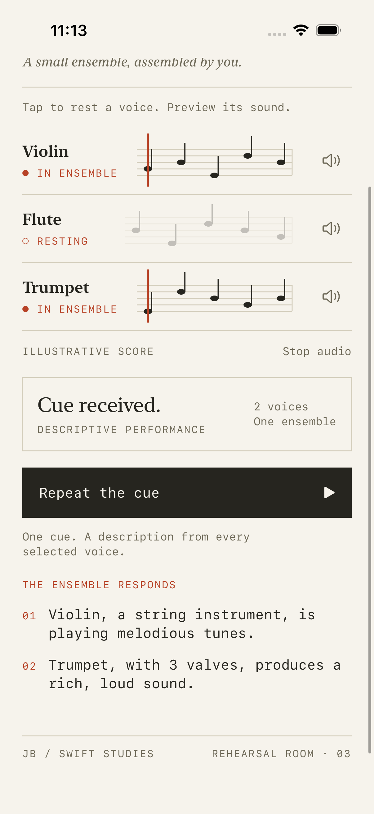

# 03 · Liskov Substitution

[All lessons](../README.md) · [Setup and test commands](../docs/SETUP.md)

An implementation must honour the behavioural expectations of the abstraction it replaces. Swift checks that a protocol's required members exist; it cannot prove that a conformer's behaviour is suitable for its callers.

In **Orchestra**, the conductor asks every selected `Playable` for a performance description. A violin, flute, trumpet, or new percussion instrument must all satisfy the same expectations without special preparation by the orchestra.

## Run the app

Open [LSPExample.xcodeproj](LSPExample.xcodeproj), select the shared `LSPExample` scheme and a compatible iPhone simulator, then press **Cmd+R**.

1. The rehearsal starts with all three catalog instruments included.
2. Tap an instrument's name to **rest** it or include it again.
3. Press **Give the downbeat** to collect a description from every selected voice. Scroll down to read the responses.
4. Press **Repeat the cue** to perform again, or change the ensemble to start a fresh rehearsal.
5. Speaker buttons preview individual bundled recordings. **Stop audio** ends a preview.

**The score is illustrative.** `play()` returns text; it does not start a recording or synthesise music. The cue line marks a conductor action, not audio progress. Audio previews are a separate UI feature, so conformers without sound files can still participate in a concert.

## The app in action




Captured from the running app on an iPhone 17 simulator. The second screen shows the same concert operation applied to the two remaining voices.

## Before: compiles, but breaks the promise

This illustrative implementation satisfies Swift's signatures:

```swift
struct SilentInstrument: Playable {
    let id = UUID()
    let name = "Silent instrument"
    func play() -> String { "" }
}
```

The conductor expects a usable description identifying the voice. An empty result weakens that guarantee, even though the code compiles. A conformer that crashes unless the caller first tunes it would introduce a stronger precondition and also violate this contract.

The tests include the empty-result example so the shared contract check can demonstrate a failure without deliberately crashing the test process.

## After: write down the behavioural contract

[Playable.swift](LSPExample/Protocols/Playable.swift) documents the expectations:

| Expectation | What each conformer must do |
| --- | --- |
| Stable identity | Keep `id` and `name` unchanged across calls to `play()` |
| Useful result | Return a nonblank description containing the instrument's name |
| No extra preparation | Work without prior tuning, blowing, audio playback, or a concrete-type cast |
| Repeatable operation | Remain usable on subsequent calls |

The service still performs through one uniform operation:

```swift
func performConcert() -> [String] {
    instruments.map { $0.play() }
}
```

The shared test check calls each instrument twice before any capability-specific preparation. It verifies the descriptions and identity, then the broader suite checks substitution through the orchestra itself.

This is a contract for this small example, not a universal definition of musical instruments. LSP is about preserving the expectations of **your** abstraction.

## LSP and ISP answer different questions

`Tunable` and `Blowable` describe optional capabilities. Separating them illustrates ISP: an instrument need not implement operations it does not support. LSP asks whether a type honours the behaviour of the abstractions it *does* support.

The orchestra may query these capabilities in `tuneAll()` and `blowAll()`. It never makes them a prerequisite for `performConcert()`. The test-only percussion instrument implements neither and still plays successfully.

## Read the source

1. [Playable.swift](LSPExample/Protocols/Playable.swift): start with the documented behaviour.
2. [StringInstrument.swift](LSPExample/Models/StringInstrument.swift), [WindInstrument.swift](LSPExample/Models/WindInstrument.swift), and [BrassInstrument.swift](LSPExample/Models/BrassInstrument.swift): compare the implementations with that contract.
3. [OrchestraService.swift](LSPExample/Services/OrchestraService.swift): follow the uniform concert and the independent capability operations.
4. [LSPExampleTests.swift](LSPExampleTests/LSPExampleTests.swift): read `contractViolations`, then the positive and negative examples.
5. [InstrumentInfo.swift](LSPExample/Models/InstrumentInfo.swift): see concrete instruments assembled from catalog metadata.
6. [ContentView.swift](LSPExample/ContentView.swift): trace an explicit conductor action to the service and its displayed results.

The catalog's `Kind` switch is deliberately at composition. It selects implementations to create; the concert never switches on concrete instrument types. This lesson does not claim the catalog is open to arbitrary plugins. Unknown kind values fail decoding instead of silently becoming string instruments.

## Read and run the tests

Press **Cmd+U** in Xcode. The focused unit tests cover:

- The same behavioural contract for every instrument constructed from the bundled catalog.
- Detection of the deliberately empty performance result.
- A percussion conformer working without tuning or blowing.
- Concert ordering, stable identities, resting/rejoining, duplicate selection, and an empty ensemble.
- Unique catalog IDs and audio previews that can actually be decoded.

The [UI tests](LSPExampleUITests/LSPExampleUITests.swift) check resting a voice, the remaining performance responses, disabling an empty concert, and navigation at the largest accessibility text size.

Passing tests provide evidence for the cases exercised. They cannot prove that every future conformer, every input, or every side effect satisfies LSP.

## The rehearsal-score design

The app uses a printed-score layout, serif instrument names, monospaced rehearsal labels, and a warm cue colour. Colours adapt to system appearance; accessibility text switches rows into vertical layouts. Decorative notation is hidden from VoiceOver, while the controls announce instrument names and whether they are included or resting.

- [ScoreStaffView.swift](LSPExample/Views/ScoreStaffView.swift) draws the illustrative notation.
- [InstrumentRowView.swift](LSPExample/Views/InstrumentRowView.swift) presents selection and preview actions.
- [OrchestraPerformanceView.swift](LSPExample/Views/OrchestraPerformanceView.swift) displays a captured report; it does not call `play()` during view redraws.
- [RehearsalStyle.swift](LSPExample/Views/RehearsalStyle.swift) owns the visual styling.

The source folder is now named `Views`. The old unused alternate orchestra screen and separate selection screen were removed to leave one clear flow to study.

## Exercise

Add a production `PercussionInstrument` that conforms only to `Playable`. Give it a stable ID and name, a nonblank performance description, and no preparation requirement.

Add it to the shared contract checks and an orchestra. Confirm that it performs, repeats successfully, and is absent from tuning and blowing results. Do not change `OrchestraService` to recognise percussion.

For a stretch exercise, make a test-only conformer change its ID during `play()` and confirm that the contract check catches the violation. Exposing percussion in the app catalog is a separate UI/composition exercise.

[Compare with the solution](SOLUTION.md).

## Tradeoffs and interview discussion

Separate capabilities when consumers need them independently. Avoid unsupported stub operations, but do not fragment a cohesive interface just to increase the protocol count.

The sample data is a bundled teaching fixture. `Bundle.decode` currently stops on missing or malformed catalog data; a production app loading external data needs recoverable loading/error states. Audio errors are recoverable and do not prevent descriptive performances.

Discuss: **What behaviour could violate LSP even though every Swift protocol requirement is implemented?** Explain a stronger precondition, a weakened result guarantee, or a broken identity invariant using these examples.

## Continue learning

[← 02 · Open/Closed](../Open-Closed-Principle-%28OCP%29-Galactic-Explorer/README.md) · [04 · Interface Segregation →](../EcoShop%20Backend%20ISP/README.md)
