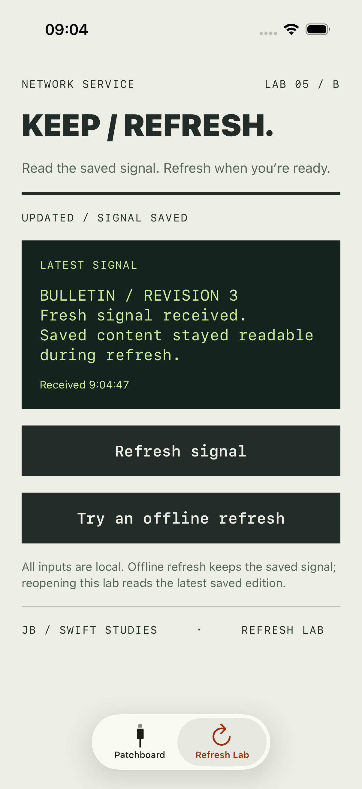
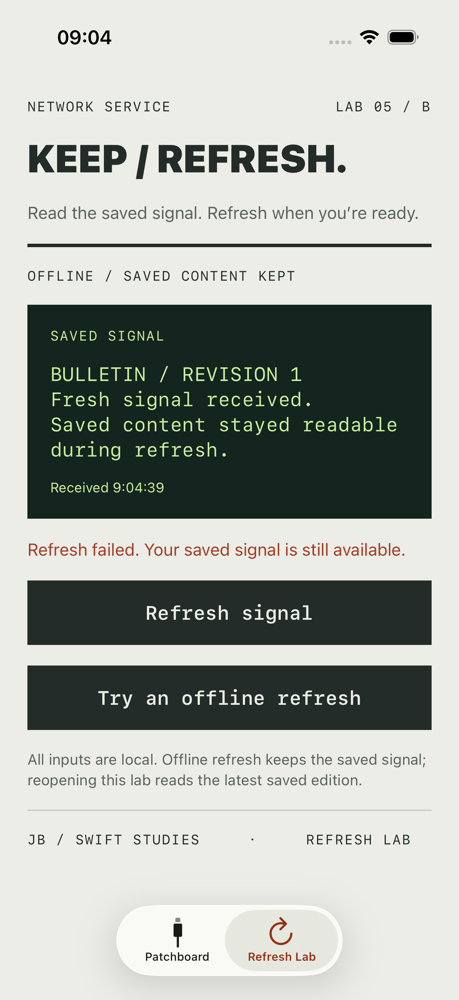
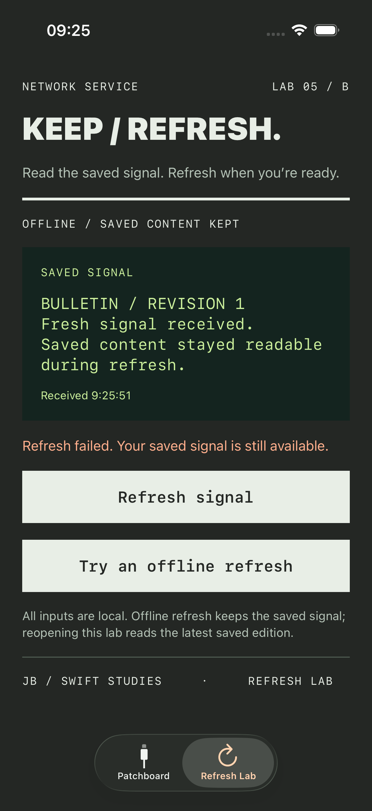
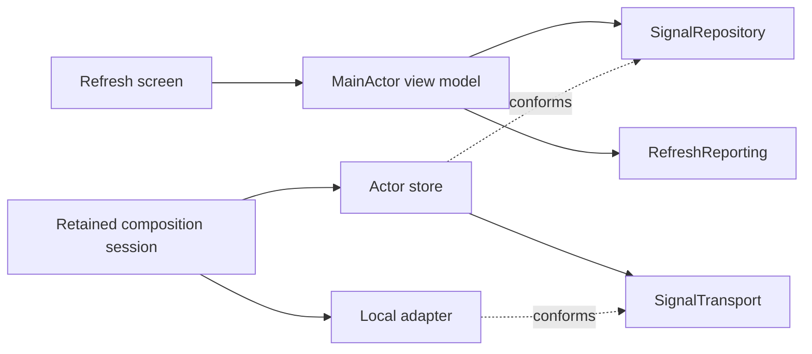

# 05 / B · Keep content while refreshing

[Foundation lesson](../README.md) · [Learning progression](../../docs/LEARNING_PATH.md) · [Setup](../../docs/SETUP.md)

The patchboard answers “can I replace the source without rewriting the receiver?” This lab adds a different problem: **readers should keep useful content while updates are slow or unavailable, and late work must not corrupt a shared cache**.

## Scenario and constraints

A bulletin screen displays its last saved signal immediately and checks for an update. Connectivity can fail. The user can refresh again, cancel, or leave the screen. More than one consumer may use the same repository.

This is an offline, in-memory laboratory. There is no HTTP request, disk persistence, freshness expiry, account switching, automatic retry, or request deduplication. Those requirements would change the design and are discussed separately. The seed is a simulated saved edition, not data from an earlier app launch.

## Compare the scope of thinking

| Question | Patchboard / foundation | Feature ownership | This system-ownership exercise |
| --- | --- | --- | --- |
| What can change? | A networking implementation | User-visible loading and recovery | Shared cache policy and dependency lifetimes |
| What is the contract? | Return bytes or throw | Newest screen request wins; cancellation is not failure | Latest refresh issued for a URL owns permission to update its cache |
| What must survive failure? | A readable error | A usable screen and retry path | Previously saved content and trustworthy ordering |
| What is the evidence? | Inject a replacement | Test errors and late UI results | Force cache races, test invariants, explain migration and diagnostics |

The advanced implementation uses one consumer-owned repository contract and one transport contract. It deliberately avoids copying the patchboard's forwarding repository/use-case chain: that extra layer adds no policy to this scenario.

## Run the lab

Open the [same Xcode project](../ModularNetworkServiceExample.xcodeproj), run its app scheme, and select **Refresh Lab** in the tab bar.

- Opening shows a simulated saved edition and refreshes automatically. Updated inputs take three seconds.
- **Refresh signal** retrieves another numbered local bulletin. During refresh, the previous content stays visible and is labelled **SAVED SIGNAL**.
- **Try an offline refresh** fails after three seconds. The payload stays readable with a warning.
- **Cancel refresh** stops the screen's interest immediately and preserves its content.
- Leave and return to the tab: the session's shared repository retains the latest saved signal and the screen revalidates it. Relaunching the app creates a new session and seed.

The lab shares the patchboard's visual identity. Both dark appearance and large text use the same adaptive styles.

Actual iPhone simulator screenshots exported from the passing UI tests.

Dark appearance

## Behavioural contract

| Event | Screen | Cache |
| --- | --- | --- |
| Open or refresh | Show saved content, mark it saved, then request an update | Existing entry is readable while transport is suspended |
| Accepted success | Show the new snapshot and receipt time | Commit bytes and timestamp together |
| Failure | Keep content and show a warning; distinguish no-cache first load | Preserve the previous entry |
| Explicit cancellation | Stop loading immediately, keep content, no failure warning | A cancelled request cannot commit after its transport returns |
| Older completion | Cannot replace the newer screen state | Cannot commit if a newer refresh was issued for that URL |
| Newer refresh fails | Show its failure with saved content | Older work does not regain permission to commit |
| Different URL | Independent request ownership | One URL's refresh does not invalidate another's |

“Latest” means **issued at the repository boundary**, not the time a server generated its data. Outcome precedence is cancellation, then supersession, then transport success/failure. Obsolete errors do not masquerade as current transport failures. Cancellation is checked before the cache commit. A cancellation arriving after a completed commit does not undo that commit. The cache is not a transaction spanning the repository and UI.

## Read the implementation

1. [SignalContracts.swift](../ModularNetworkServiceExample/Advanced/SignalContracts.swift): consumer-facing snapshots and repository operations; transport is separately replaceable.
2. [RefreshingSignalStore.swift](../ModularNetworkServiceExample/Advanced/RefreshingSignalStore.swift): actor-owned entries and request identities. Explain why identity must be rechecked after `await`.
3. [RefreshViewModel.swift](../ModularNetworkServiceExample/Advanced/RefreshViewModel.swift): preserve the payload, distinguish warnings from content, and gate screen publication independently.
4. [RefreshLabComposition.swift](../ModularNetworkServiceExample/Advanced/RefreshLabComposition.swift): the retained session owns the transport and model together. Rebuilding a SwiftUI value must not pair an old model with a new adapter.
5. [RefreshReporting.swift](../ModularNetworkServiceExample/Advanced/RefreshReporting.swift): injected lifecycle reporting. The system logger records event names, not payloads, URLs, or raw errors.
6. [RefreshLabView.swift](../ModularNetworkServiceExample/Advanced/RefreshLabView.swift): observe the model, configure local inputs at the outer boundary, cancel screen-owned work on disappearance.

## Evidence and tradeoffs

[RefreshLearningTests.swift](../ModularNetworkServiceExampleTests/RefreshLearningTests.swift) has controlled arrivals and explicit completions rather than timing sleeps. The cache tests make the **newer request finish first without cancelling the older request**. The view-model tests separately use a repository that intentionally ignores ordering and cancellation so its consumer protections are tested independently.

[UI tests](../ModularNetworkServiceExampleUITests/ModularNetworkServiceExampleUITests.swift) cover offline content retention and recovery, cancellation and tab reopening, and the largest accessibility text size. Run them through the [common test command](../../docs/SETUP.md#execute-tests-from-terminal).

Read [the decision record](DECISION.md) for alternatives, lifetime choices, diagnostic limits, and migration steps. Actor isolation prevents unsynchronised access to actor state; it does not by itself preserve assumptions across suspension. See Swift's [actor reentrancy proposal](https://github.com/swiftlang/swift-evolution/blob/main/proposals/0306-actors.md).

## Try a new constraint

Attempt the [freshness exercise](EXERCISE.md), then open its separate solution. Use the [interview prompts](INTERVIEW.md) to practise explaining the design before reading the answer notes.
