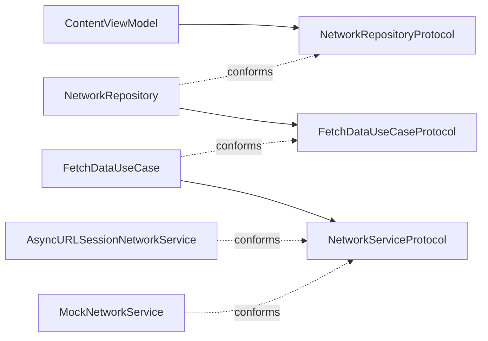

# 05 · Dependency Inversion

[All lessons](../README.md) · [Setup and test commands](../docs/SETUP.md)

High-level policy and low-level details should depend on abstractions. A view model's loading behaviour should not need rewriting when the networking implementation changes.

In **Network Service**, protocols separate the view model, repository, use case, networking, and logging. Constructor injection makes those dependencies replaceable.

## Run the app

Open the [Xcode project](ModularNetworkServiceExample.xcodeproj), select the `ModularNetworkServiceExample` scheme and an iPhone simulator running iOS 17.2 or later, then press **Cmd+R**.

**Current demo limitation:** the default configuration uses `https://api.example.com/data`, a placeholder endpoint. Do not expect a successful live response. Start with the mock-based tests below for deterministic success and failure scenarios.

## Before: the policy chooses its infrastructure

Illustrative sketch:

```swift
final class ContentViewModel {
    private let service = AsyncURLSessionNetworkService()
    // Loading behaviour now chooses its concrete network implementation.
}
```

Replacing the network with a fixture requires editing the consumer or introducing another interception mechanism.

## After: accept dependencies through abstractions

The real initializer accepts a repository and logger:

```swift
public init(
    networkRepository: NetworkRepositoryProtocol,
    logger: LoggingServiceProtocol = LoggingService.shared
)
```

Tests supply concrete objects at the outer boundary. The view model's loading code uses the protocols. The default logger still names a concrete singleton as a convenience; pass the logger explicitly when you want all choices to live at composition.



The arrows show dependencies on contracts, with concrete implementations supplying them. The runtime call path is view model → repository → use case → network service.

## Read the source

1. [ContentViewModel.swift](ModularNetworkServiceExample/ViewModels/ContentViewModel.swift): begin with the policy and its initializer.
2. [NetworkRepositoryProtocol.swift](ModularNetworkServiceExample/Protocols/NetworkRepositoryProtocol.swift): inspect the contract used by the view model.
3. [NetworkRepository.swift](ModularNetworkServiceExample/Classes/Repositories/NetworkRepository.swift) and [FetchDataUseCase.swift](ModularNetworkServiceExample/Classes/UseCases/FetchDataUseCase.swift): follow the call path.
4. [NetworkServiceProtocol.swift](ModularNetworkServiceExample/Protocols/NetworkServiceProtocol.swift) and [MockNetworkService.swift](ModularNetworkServiceExample/Services/Network/MockNetworkService.swift): compare the boundary with a substitute.
5. [DIContainer.swift](ModularNetworkServiceExample/Services/DIContainer.swift): read the app's assembly code last.

Dependency injection is a wiring technique; dependency inversion is the design of the dependency boundaries. A container is optional. This app's view resolves from a shared container, while its view model supports direct construction.

## Read and run the tests

Open [ContentViewModelTests.swift](ModularNetworkServiceExampleTests/ContentViewModelTests.swift) and press **Cmd+U**.

- `testViewModelLoadsDataThroughInjectedNetworkAbstractions` assembles the dependency chain with mock networking and logging.
- `testViewModelReportsErrorsThroughInjectedNetworkAbstractions` checks the failure path.
- The remaining tests exercise overlapping loads and cancellation. They are useful asynchronous behaviour checks in addition to the SOLID lesson.

The mock-based tests do not need the placeholder endpoint to work. For further hardening, control request completion explicitly in concurrency tests instead of relying on short sleeps.

## Exercise

Write a test that supplies a `NetworkRepositoryProtocol` returning fixed bytes directly to `ContentViewModel`. Await the task returned by `loadData`, and assert the exact bytes, no error, and a finished loading state.

Do not use `DIContainer` or change `ContentViewModel`. Explain why this smaller test is useful alongside the existing tests of the assembled chain.

[Compare with the solution](SOLUTION.md).

## Tradeoffs and interview discussion

The repository currently forwards to a use case, which delegates to networking. Multiple layers make boundaries visible but add little policy in this small example. Keep them only when their responsibilities justify the extra navigation; DIP does not prescribe this exact layering or number of protocols.

The shared container uses runtime lookup and terminates for missing registrations. Explicit constructor assembly is simpler for a small dependency graph and makes missing arguments compiler-visible.

Discuss: **Which abstraction belongs at the view model boundary, and what independent change would justify keeping each extra layer?**

## Continue learning

[← 04 · Interface Segregation](../EcoShop%20Backend%20ISP/README.md) · [Return to the learning path](../README.md)
