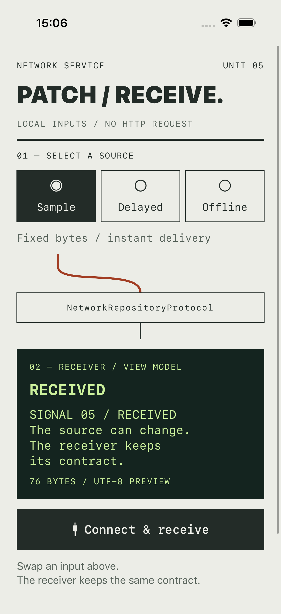
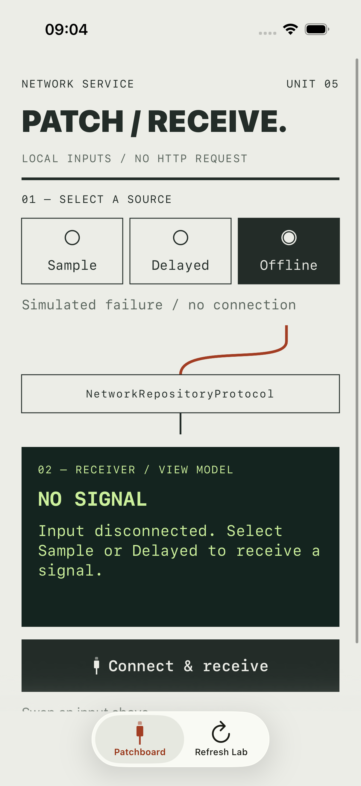
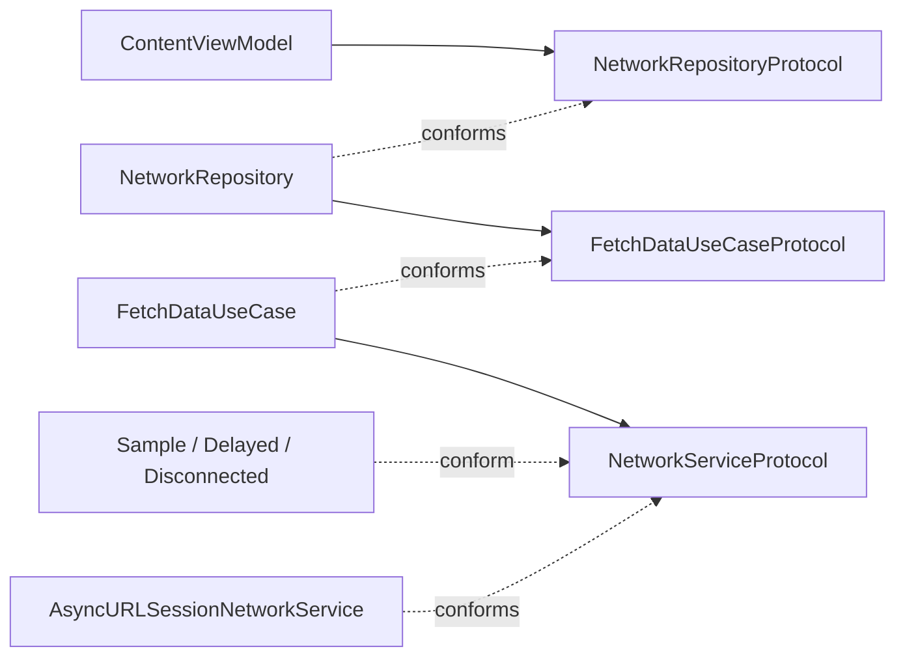

# 05 · Dependency Inversion

[All lessons](../README.md) · [Setup and test commands](../docs/SETUP.md)

High-level policy and low-level details should depend on abstractions. A view model’s loading behaviour should not need rewriting when its data source changes.

**Network Service** is an offline patchboard: select an input, connect it, and inspect the receiver. The visible source changes; the receiver’s code and dependency contract do not.

## Run the app

Open the [Xcode project](ModularNetworkServiceExample.xcodeproj), select the shared `ModularNetworkServiceExample` scheme and an iPhone simulator running iOS 17.2 or later, then press **Cmd+R**.

| Input | Result | Try this |
| --- | --- | --- |
| Sample | Fixed UTF-8 bytes immediately | Connect and inspect the payload |
| Delayed | The same bytes after three seconds | Cancel reception, then reconnect |
| Offline | A readable simulated error | Switch to Sample and reconnect |

These inputs make **no HTTP requests**. The URL passed through the graph identifies the demonstration request; the offline adapters ignore it. The app no longer starts by calling a placeholder endpoint.




Actual running-app screenshots. The patch cable is a diagram of the dependency boundary, not a network activity trace.

## Before: policy chooses its infrastructure

Illustrative sketch:

```swift
final class ContentViewModel {
    private let service = AsyncURLSessionNetworkService()
    // Loading behaviour now chooses a concrete network implementation.
}
```

Replacing the transport requires changing the consumer. A shared service locator can hide that choice, but it also hides the consumer’s requirements and moves missing-dependency failures to runtime.

## After: accept dependencies through abstractions

The real initializer requires both dependencies explicitly:

```swift
public init(
    networkRepository: NetworkRepositoryProtocol,
    logger: LoggingServiceProtocol
)
```

`NetworkComposition` chooses concrete adapters and assembles the graph. `ContentView` receives an already assembled repository and logger. Neither the receiver view nor its view model resolves a global container or switches on concrete source types.


```mermaid
flowchart LR
    VM[ContentViewModel] --> RP[NetworkRepositoryProtocol]
    R[NetworkRepository] -. conforms .-> RP
    R --> UP[FetchDataUseCaseProtocol]
    U[FetchDataUseCase] -. conforms .-> UP
    U --> NP[NetworkServiceProtocol]
    S[Sample / Delayed / Disconnected] -. conform .-> NP
    HTTP[AsyncURLSessionNetworkService] -. conforms .-> NP
```

The runtime call path is view model → repository → use case → service. The consumer depends on a contract; infrastructure supplies an implementation of it. Dependency injection is the wiring technique. Dependency inversion describes the direction of the source-code dependencies. A container is not required.

The source picker belongs to composition. Selecting another input creates a fresh receiver instance with the new graph, cancels the old reception, and resets the display to standby. It reuses the **same receiver implementation**, rather than mutating that implementation to understand more source types.

## Read the source

1. [ContentViewModel.swift](ModularNetworkServiceExample/ViewModels/ContentViewModel.swift): inspect its explicit dependencies and loading/cancellation policy.
2. [NetworkRepositoryProtocol.swift](ModularNetworkServiceExample/Protocols/NetworkRepositoryProtocol.swift): read the contract used by that policy.
3. [NetworkRepository.swift](ModularNetworkServiceExample/Classes/Repositories/NetworkRepository.swift) and [FetchDataUseCase.swift](ModularNetworkServiceExample/Classes/UseCases/FetchDataUseCase.swift): trace the forwarding and logging.
4. [DemoNetworkService.swift](ModularNetworkServiceExample/Services/Network/DemoNetworkService.swift): compare three implementations of the same network contract.
5. [NetworkComposition.swift](ModularNetworkServiceExample/Services/NetworkComposition.swift): locate the concrete choices, deliberately outside the consumer.
6. [NetworkLabView.swift](ModularNetworkServiceExample/Views/NetworkLabView.swift) and [ContentView.swift](ModularNetworkServiceExample/Views/ContentView.swift): separate the source picker from the receiver. Drawing and colours live in [PatchboardStyle.swift](ModularNetworkServiceExample/Views/PatchboardStyle.swift).

## Read and run the tests

Open [ContentViewModelTests.swift](ModularNetworkServiceExampleTests/ContentViewModelTests.swift), or use the [Terminal commands](../docs/SETUP.md).

- `testViewModelLoadsDataThroughInjectedNetworkAbstractions` supplies mock networking and logging to the complete graph and checks the exact bytes.
- `testViewModelReportsErrorsThroughInjectedNetworkAbstractions` exercises failure through those same contracts.
- `testLatestDataLoadWinsWhenRequestsOverlap` and `testCancelledOlderFailureCannotOverwriteNewerSuccess` explicitly complete the newest request first. The older fixture deliberately ignores cancellation.
- `testExplicitCancellationIgnoresLateFailure` verifies that cancellation clears loading immediately and does not become an error later.

The controlled repository uses continuations to determine completion order. It does not rely on short sleeps to happen in the expected order. These asynchronous correctness checks complement the DIP lesson; they are not themselves a definition of DIP.

[Composition tests](ModularNetworkServiceExampleTests/ModularNetworkServiceExampleTests.swift) verify the sample payload, offline error, and delayed adapter’s cancellation. [UI tests](ModularNetworkServiceExampleUITests/ModularNetworkServiceExampleUITests.swift) exercise switching, receiving, cancelling, retrying, and accessibility text.

## Exercise

Write a test that supplies a `NetworkRepositoryProtocol` returning fixed bytes directly to `ContentViewModel`. Await the task returned by `loadData`, and assert the exact bytes, no error, and a finished loading state.

Do not use the composition factory or change `ContentViewModel`. Explain why this smaller test is useful alongside the existing tests of the assembled chain.

[Compare with the solution](SOLUTION.md).

## Tradeoffs and interview discussion

- **Layering:** the repository forwards to a use case, which delegates to networking and logs the result. These layers make boundaries visible but add little policy here. DIP does not prescribe this number of protocols; a smaller app could use one consumer-owned fetching contract.
- **Ownership:** the sample repository contract lives in the same app target as its implementations. Separate packages are not necessary to demonstrate the dependency direction, but can enforce it in larger systems.
- **Cancellation:** each load has an identity established before its task starts. Cancellation is cooperative; identity checks also protect the UI from adapters that finish late. Switching sources resets state intentionally.
- **Preview:** the receiver displays a bounded UTF-8 preview, a byte count, or a binary/empty-payload message. It does not parse a domain model or render HTML.
- **Live networking:** `AsyncURLSessionNetworkService` remains a separate HTTP adapter and is not selected by the demo. A live extension needs a real endpoint and HTTP tests. The legacy `ConfigManager`, `RetryManager`, and Combine service are not part of the active graph. The retained HTTP helpers still use shared URLSession/logging; inject those when hardening a live extension. The Combine service returns a publisher and is not a drop-in async conformer.

Discuss: **Which contract belongs to the consumer, and what independent change would justify keeping each extra layer? Where should concrete configuration live?**

## Advance the lesson

Continue to [05 / B · Keep content while refreshing](Advanced/README.md). The second **Refresh Lab** tab preserves cached content during slow or offline updates and rejects obsolete writes to a shared actor-owned cache. Compare the contracts and layer choices with this patchboard, then attempt its freshness exercise and interview questions.

See the [learning progression](../docs/LEARNING_PATH.md) for the difference between explaining a boundary, owning a feature, and making decisions under broader constraints.

## Continue learning

[← 04 · Interface Segregation](../EcoShop%20Backend%20ISP/README.md) · [Return to the learning path](../README.md)
