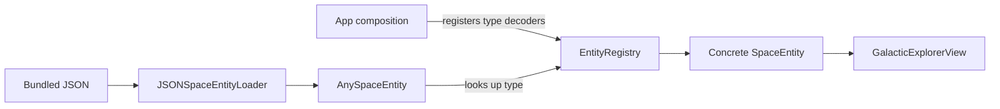

# 02 · Open/Closed

[All lessons](../README.md) · [Setup and test commands](../docs/SETUP.md)

Software should be open for extension and closed for modification at a chosen boundary. The goal is to support an anticipated kind of change without repeatedly editing the stable algorithm that consumes it.

In **Galactic Explorer**, that boundary is entity decoding: new space entity types can supply their own decoders and views.

## Run the app

Open the [Xcode project](Open-Closed-Principle-%28OCP%29-Galactic-Explorer.xcodeproj), select the `Open-Closed-Principle-(OCP)-Galactic-Explorer` scheme and a compatible iPhone simulator, then press **Cmd+R**. The app opens an orbital atlas from bundled `entities.json`; this default path needs no network service. Tap a numbered map marker or an object name to select an observation. **Next observation** cycles through the collection. The map is a schematic index, not a simulation of physical orbits.


## Before: every new type changes the decoder

Illustrative sketch:

```swift
switch typeName {
case "Planet": return try Planet(from: decoder)
case "Star": return try Star(from: decoder)
case "Comet": return try Comet(from: decoder)
default: throw UnsupportedEntity.unknownType
}
```

Adding an asteroid requires editing the same switch that already knows about planets, stars, and comets. A switch can be appropriate for a deliberately closed set. Here, the learning exercise explicitly asks us to support new types independently.

## After: register the variation

The existing [production registration function](Closed-Principle-%28OCP%29-Galactic-Explorer/Services/EntityRegistration.swift) assembles the supported types:

```swift
let registry = EntityRegistry()
registry.register("Planet") { decoder in try Planet(from: decoder) }
registry.register("Star") { decoder in try Star(from: decoder) }
registry.register("Comet") { decoder in try Comet(from: decoder) }
```

The [registry](Closed-Principle-%28OCP%29-Galactic-Explorer/Services/EntityRegistry.swift) reads the JSON `type`, finds its decoder closure, and delegates decoding. That lookup algorithm does not need another branch when a new type is registered.



`SpaceEntity` is a protocol: `Planet` conforms to it; it is not its subclass. Each entity supplies `makeView()`, allowing the atlas to display the result without adding a type switch of its own.

**Closed does not mean no files ever change.** Registration is the composition boundary and is expected to change when the app gains an entity. The reusable decoding algorithm stays unchanged.

## Read the source

1. [SpaceEntity.swift](Closed-Principle-%28OCP%29-Galactic-Explorer/Models/SpaceEntity.swift): identify the data and rendering contract.
2. [Planet.swift](Closed-Principle-%28OCP%29-Galactic-Explorer/Models/Planet.swift): inspect one concrete conformer and its coding keys.
3. [EntityRegistry.swift](Closed-Principle-%28OCP%29-Galactic-Explorer/Services/EntityRegistry.swift): follow `register`, `decode`, and the `AnySpaceEntity` wrapper.
4. [EntityRegistration.swift](Closed-Principle-%28OCP%29-Galactic-Explorer/Services/EntityRegistration.swift): find where the app chooses its supported types.
5. [JSONSpaceEntityLoader.swift](Closed-Principle-%28OCP%29-Galactic-Explorer/Services/JSONSpaceEntityLoader.swift): see the registry passed through `JSONDecoder.userInfo`.
6. [GalacticExplorerView.swift](Closed-Principle-%28OCP%29-Galactic-Explorer/Views/GalacticExplorerView.swift): see the atlas select entities and render their details uniformly.

The reactive, polling, API, and composite loaders are optional further reading after this bundled-data route makes sense.

## Read and run the tests

Open the [OCP unit tests](Closed-Principle-%28OCP%29-Galactic-ExplorerTests/Closed_Principle__OCP__Galactic_ExplorerTests.swift) and run them with **Cmd+U** or the [Terminal instructions](../docs/SETUP.md#execute-tests-from-terminal).

- `testBeforeAndAfterShowsWhyRegistrationKeepsDecoderClosedForChange` contrasts a fixed list of accepted types with registering a test-only asteroid. Its “before” helper is deliberately simplified; it is not a complete JSON decoder.
- `testFactoryDecodesRegisteredEntityWithoutChangingCoreDecoder` decodes an asteroid and checks its name and diameter through the existing registry algorithm.
- `testBundledEntitiesDecodeThroughProductionRegistry` loads the real bundled dataset and checks Earth, Sun, Halley, and the Sun's classification. The JSON uses `type` for entity dispatch and `spectralType` for the star's classification.

The test-only `Asteroid` is evidence of the extension point. It does not add an asteroid to the app's production registry or bundled dataset.

## The atlas design

The interface uses an astronomical field-sheet style: serif observation titles, monospaced labels, a ruled orbital diagram, and paper/ink colours that adapt to light and dark appearance.

- [OrbitalMapView.swift](Closed-Principle-%28OCP%29-Galactic-Explorer/Views/OrbitalMapView.swift) places entries by collection order, with no concrete entity checks. Every entry also has a text button for accessible selection.
- [OrbitalAtlasStyle.swift](Closed-Principle-%28OCP%29-Galactic-Explorer/Views/OrbitalAtlasStyle.swift) owns colour and typography. Built-in entities return a styled fact view through `makeView()`.
- [ExplorerViewModel.swift](Closed-Principle-%28OCP%29-Galactic-Explorer/ViewModels/ExplorerViewModel.swift) handles loading, selection, cycling, and retry state through the loader abstraction.

The atlas has empty and error states, and its layout reflows for accessibility text sizes. The [UI tests](Closed-Principle-%28OCP%29-Galactic-ExplorerUITests/Closed_Principle__OCP__Galactic_ExplorerUITests.swift) exercise selection, cycling, and large-text navigation. Unit tests also check a test-only asteroid works with the same selection logic.

**Why the button says “Next observation”:** registration happens at the app composition boundary, not when browsing the atlas. Adding a new type remains the coding exercise below.

## Exercise

Add an `Asteroid` to the running app with a name, description, and diameter in kilometres. Display it alongside the existing entities.

Acceptance criteria:

- The asteroid conforms to `SpaceEntity` and has a stable stored ID.
- The app registers the `"Asteroid"` decoder and includes a matching JSON entry.
- The decoder lookup, JSON loader, and atlas screen need no changes.
- A unit test checks the decoded name and diameter. Add an unknown-type test as a stretch goal.

Write down the files you expect to change before starting. Remember to add a new Swift file to the app target in Xcode.

[Compare with the solution and change checklist](SOLUTION.md).

## Tradeoffs and current limitations

A registry adds indirection and turns unknown type names into runtime decoding errors. A small, intentionally closed set may be clearer as an enum or switch. The registry earns its place when independent extensions are a real requirement.

This example lets models return `AnyView`, which keeps extension self-contained but couples them to SwiftUI. A larger app might separate rendering from domain data.

Every entity must now provide a stable ID: the built-in entities store a UUID for the lifetime of each decoded object. This keeps map and index selection consistent across view redraws; identity across separate loads would require persistent IDs in the data. The mutable registry still declares `@unchecked Sendable` without synchronisation. Keep registration confined to setup; the current registry is not a general-purpose thread-safe component. See [stable identity](https://developer.apple.com/documentation/Swift/Identifiable) and [Sendable responsibilities](https://docs.swift.org/latest/documentation/swift/sendable/).

Discuss: **Why is changing registration compatible with OCP, and when would you deliberately choose a switch instead?**

## Continue learning

[← 01 · Single Responsibility](../SRPExample-%20Angels%20and%20Demons/README.md) · [03 · Liskov Substitution →](../LSPExample/README.md)
