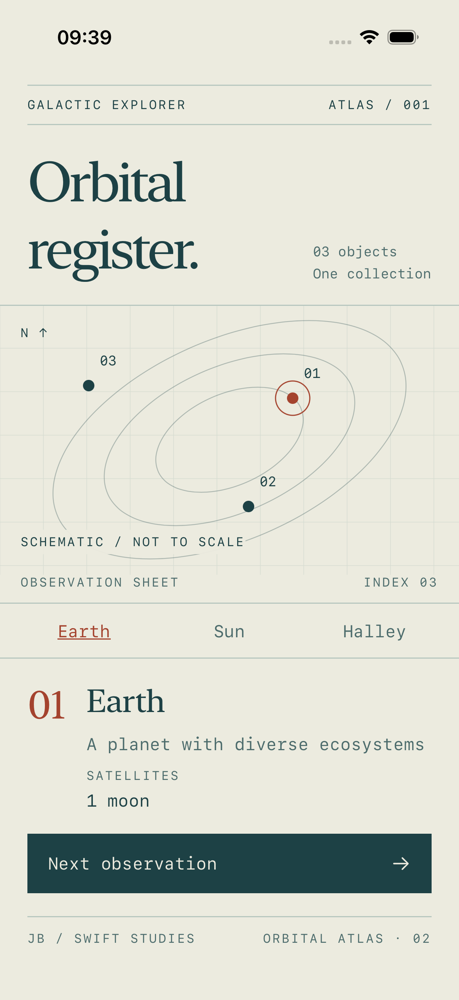
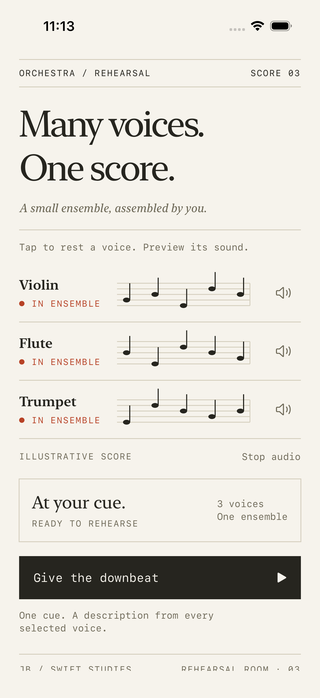

# SOLID Principles with Swift

Learn the five SOLID principles through small SwiftUI apps, guided code walkthroughs, and tests that demonstrate what can change independently.

Each lesson connects a design problem to a concrete Swift example: browse angels and demons, extend a galaxy, assemble an orchestra, manage a shop, or swap a network dependency.

## Start learning

You should be comfortable with Swift types, protocols, and basic SwiftUI. Follow the lessons in order, or jump to the principle you want to practise. Each app README includes a before/after explanation, a source reading route, relevant tests, and an exercise with a separate solution.

| Lesson | App | The question it answers |
| --- | --- | --- |
| [01 · Single Responsibility](SRPExample-%20Angels%20and%20Demons/README.md) | Angels and Demons | Can data access change independently of presentation? |
| [02 · Open/Closed](Open-Closed-Principle-%28OCP%29-Galactic-Explorer/README.md) | Galactic Explorer | Can I add an entity without rewriting the decoder? |
| [03 · Liskov Substitution](LSPExample/README.md) | Orchestra | Can every implementation honour the caller's expectations? |
| [04 · Interface Segregation](EcoShop%20Backend%20ISP/README.md) | EcoShop | Can a reader depend only on reading operations? |
| [05 · Dependency Inversion](ModularNetworkServiceExample/README.md) | Network Service | Can I replace infrastructure without rewriting the view model? |

**Suggested first deep dive:** [extend Galactic Explorer with an asteroid](Open-Closed-Principle-%28OCP%29-Galactic-Explorer/README.md). Trace the registration, inspect the decoder, and read the test that exercises the extension point.

## Inside the apps

Real app screenshots. [Extend the orbital atlas with a new entity](Open-Closed-Principle-%28OCP%29-Galactic-Explorer/README.md), or [test the behavioural contract behind the orchestra](LSPExample/README.md).

## Run an example

1. Open the Xcode project linked from its lesson.
2. Select a compatible iPhone simulator and press **Cmd+R**.
3. Press **Cmd+U** to run the tests, then try the lesson's exercise.

See [setup and test commands](docs/SETUP.md) for deployment targets, Terminal instructions, and troubleshooting. The apps are independent projects; there is no root app to run.

## Engineering decisions to explore

- **Boundaries with a purpose:** separate changes to data access, domain descriptions, and presentation in SRP.
- **Explicit extension points:** give each OCP loader or test an instance-owned entity registry.
- **Behaviour behind protocols:** examine what callers can expect from all `Playable` instruments, and distinguish LSP from capability segregation.
- **Dependencies shaped by consumers:** let the ISP list view model use a read-only catalog without implementing writes.
- **Replaceable infrastructure:** supply networking and logging through initializers; inspect DIP tests for success, failure, and request cancellation.

These are teaching examples. Each lesson discusses the cost of its abstractions and limitations of the current implementation. SOLID is a way to reason about change, not a requirement to add a protocol to every type.

See the [app design direction](docs/DESIGN.md) for the visual identity of each example and implementation status.

## How to study

Read the small before/after example first. Follow the numbered source links, run the relevant tests, then make the proposed change. Before reading the solution, write down which files you expect to edit and which should stay untouched.

For interview preparation, explain the concrete change pressure, the boundary you chose, and a situation where you would keep the design simpler. A useful explanation goes beyond naming the principle.

## Contributing

Contributions should make a lesson easier to understand or verify. Keep changes focused and include the reason behind a new abstraction. Useful contributions include clearer exercises, behavioural tests, reproducible setup fixes, and real app screenshots.

When changing an example, update its lesson and run the relevant tests. State what you verified in the pull request.

## License

[MIT](LICENSE)
