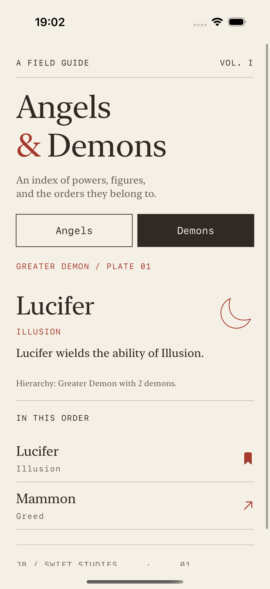

# 01 · Single Responsibility

[All lessons](../README.md) · [Setup and test commands](../docs/SETUP.md)

A type should have one reason to change. Identify responsibilities by the changes people request, rather than by counting methods or files.

**Angels and Demons** is a celestial field guide: choose a collection, select a figure from the index, and study its description on a numbered plate. The app separates data supply, loading policy, descriptive wording, and presentation so each has a clear home.

## Run the app

Open the [Xcode project](SRP-Example-Angels-and-Demons/SRP-Example-Angels-and-Demons.xcodeproj), select the shared `SRP-Example-Angels-and-Demons` scheme and an iPhone simulator running iOS 16.2 or later, then press **Cmd+R**.

- **Angels** opens with Michael. Select Gabriel to change the plate.
- **Demons** opens with Lucifer. Select Mammon to study another entry.
- Reopening a collection loads its index and selects the first figure.

Data is supplied locally after a short simulated delay. Powers and ranks are teaching fixtures, not an authoritative account of religious traditions.




Actual simulator screenshots. The sun and moon are decorative collection marks.

## Before: unrelated changes meet in one place

Illustrative sketch:

```swift
struct AngelScreen: View {
    // Owns loading, hierarchy wording, selection and layout.
    func fetchAngels() async throws -> [AngelModel] { /* ... */ }
    func describeHierarchy(_ angels: [AngelModel]) -> String { /* ... */ }
    var body: some View { /* ... */ }
}
```

A data-source change, a loading-error change, a wording change, and a layout change all lead back to the same type. The pressure comes from those independent decisions, not simply from the type being long.

## After: give changes a home

| Change request | Owner in this example |
| --- | --- |
| Change how sample data is supplied | `DataService` behind `DataServiceProtocol` |
| Change loading, errors or retry policy | `AngelCatalogViewModel` / `DemonCatalogViewModel` |
| Change the hierarchy description | `AngelHierarchy` / `DemonHierarchy` |
| Change a figure's descriptive wording | `AngelModel` / `DemonModel` |
| Change the selected plate and index layout | `AngelListView` / `DemonListView` |
| Change the plate's typography and marks | `GuidePlate` and `GuideStyle` |
| Change which collection is visible | `ContentView` |

The views invoke `load()` at the SwiftUI lifecycle boundary. The view models fetch data, construct hierarchies and expose loading/error state. The views decide how to display that state. Descriptions remain callable without constructing a service or rendering SwiftUI.

Selection belongs to the index's presentation state. Rows use explicit figure identities; names need not be unique. The sample supplier provides stable IDs, while independently created models receive a UUID string by default.

SRP is about reasons to change, not a rule that every type must contain one operation. A loading model can own loading, failure and retry because those are related parts of one UI-state policy.

## Read the source

1. [DataService.swift](SRP-Example-Angels-and-Demons/SRP-Example-Angels-and-Demons/DataService/DataService.swift): locate data supply independently of the UI.
2. [CatalogViewModels.swift](SRP-Example-Angels-and-Demons/SRP-Example-Angels-and-Demons/CatalogViewModels.swift): follow loading, failure and recovery.
3. [AngelHierarchy.swift](SRP-Example-Angels-and-Demons/SRP-Example-Angels-and-Demons/Angel/AngelHierarchy.swift) and [DemonHierarchy](SRP-Example-Angels-and-Demons/SRP-Example-Angels-and-Demons/Devil/DevilHierarchy.swift): inspect hierarchy wording independently of data supply.
4. [AngelModel.swift](SRP-Example-Angels-and-Demons/SRP-Example-Angels-and-Demons/Angel/AngelModel.swift): inspect identity and power description.
5. [AngelListView.swift](SRP-Example-Angels-and-Demons/SRP-Example-Angels-and-Demons/Angel/AngelListView.swift) and [AngelDetailView.swift](SRP-Example-Angels-and-Demons/SRP-Example-Angels-and-Demons/Angel/AngelDetailView.swift): trace selection and plate presentation.
6. [GuideStyle.swift](SRP-Example-Angels-and-Demons/SRP-Example-Angels-and-Demons/GuideStyle.swift): find the visual language and shared view components.

The original `Devil` folder and filenames contain the `Demon…` types referenced in this lesson.

## Read and run the tests

Open the [unit tests](SRP-Example-Angels-and-Demons/SRP-Example-Angels-and-DemonsTests/SRP_Example_Angels_and_DemonsTests.swift), or use the [Terminal commands](../docs/SETUP.md).

- `testHierarchyDescriptionCanChangeWithoutTouchingViewsOrDataService` checks wording without either dependency.
- `testModelOwnsAngelPowerDescriptionWithoutNeedingAView` checks a figure description without rendering.
- `testAngelLoadingUsesOnlyTheAngelDataOperation` and its demon counterpart check the supplied collection and loading state.
- Failure/recovery tests substitute a failing supplier, then retry successfully through the same model.
- Empty-result and cancellation tests check that loading finishes without being mistaken for a failure.

The [UI tests](SRP-Example-Angels-and-Demons/SRP-Example-Angels-and-DemonsUITests/SRP_Example_Angels_and_DemonsUITests.swift) exercise both collections, selection, reopening an index and the largest accessibility text size. Dark appearance is also checked visually.

These checks provide evidence that behaviours can be exercised independently. They do not automatically prove that every future responsibility will be perfectly separated.

## Exercise

Change the hierarchy description to include member names, for example: `Archangel: Michael, Gabriel`.

Before editing, identify the owner. Update the description and its assertion without changing data loading or view layout. As a stretch exercise, consider where this wording should live if it must be localised.

[Compare with the solution](SOLUTION.md).

## Tradeoffs and interview discussion

- **Two small loading models:** angels and demons currently share a similar loading flow. A generic abstraction could reduce duplication, but adds another concept for this first lesson. Extract it when shared policy grows enough to justify it.
- **Fixed ranks:** the loading models assign illustrative ranks to each collection. If ranks become server-controlled, the data contract should return that information rather than leave the assumption in UI policy.
- **Descriptions:** English prose currently lives with models and hierarchies. Localisation or multiple presentation formats would give a reason to move wording into formatters.
- **Identity:** the bundled supplier's IDs are stable across reloads. A real data source should supply persistent identity instead of recreating default UUIDs on every fetch.
- **Scope:** this guide uses local fixtures. There is no persistence or network integration to maintain.

Discuss: **Which files should change if data comes from disk? Which should change if a designer asks for different typography? Why are those different responsibilities?**

## Continue learning

[02 · Open/Closed →](../Open-Closed-Principle-%28OCP%29-Galactic-Explorer/README.md)
